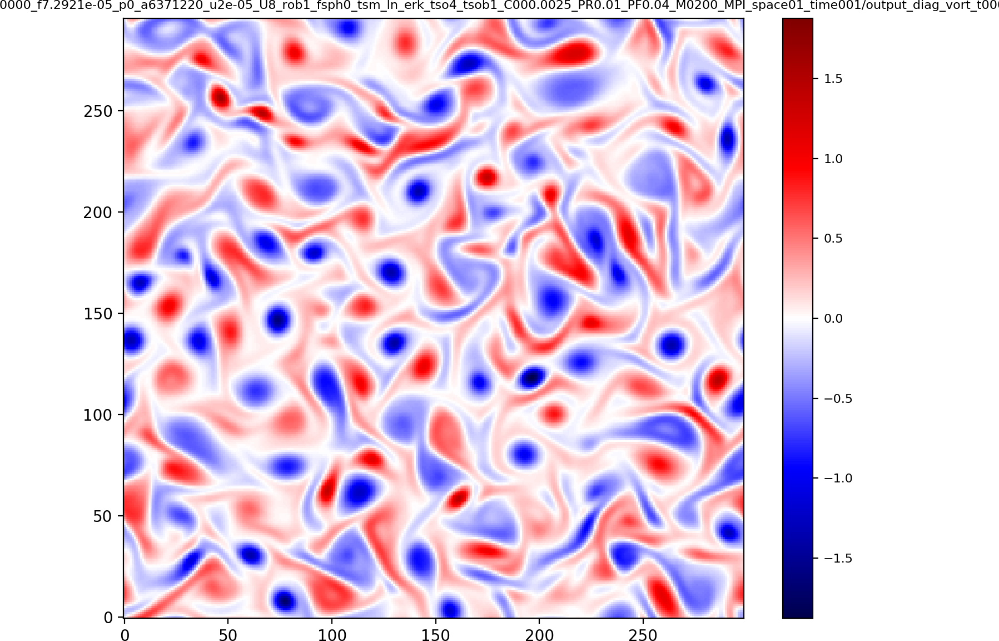

SWEET has an interactive GUI frontend as well as a file backend. This was used to generate the following images and videos:

<h2>Shallow-water equations on the plane</h2>

<h3>Galwesky-like benchmark on plane (unstable jet)</h3>
  

<h3>Polvani tests (<a href="gallery/polvani.html">see more</a>)<h3>
  

<h2>Shallow-water equations on the sphere</h2>

<h3>Galewsky benchmark</h3>
  

<h3>Propagating Gaussian bumps on rotating sphere</h3>
  

