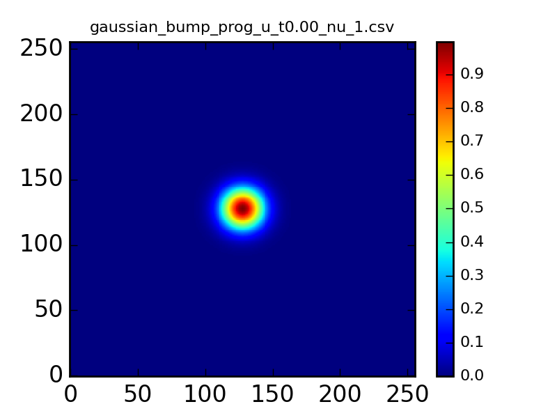
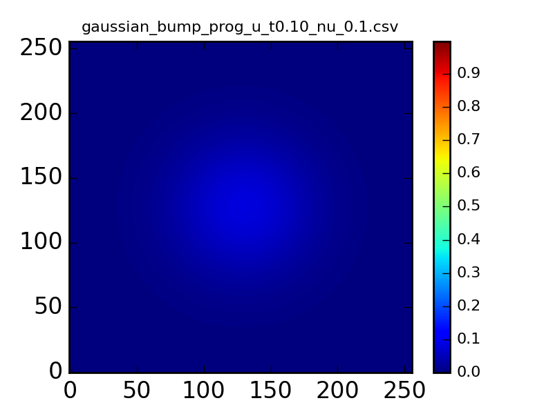
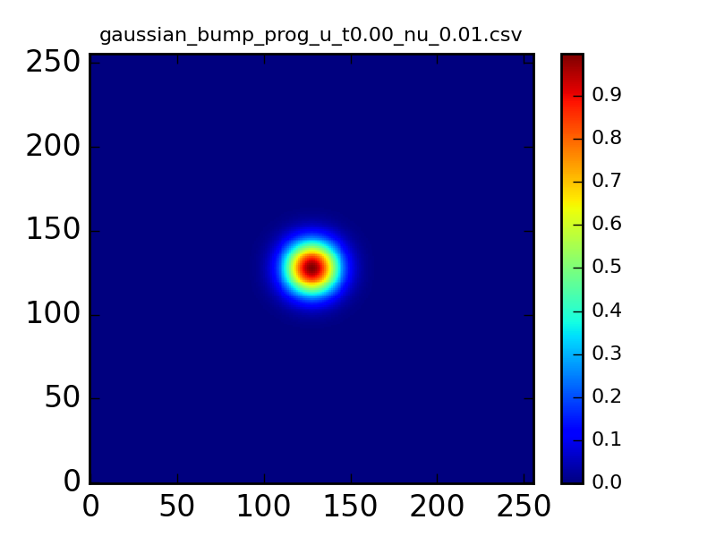
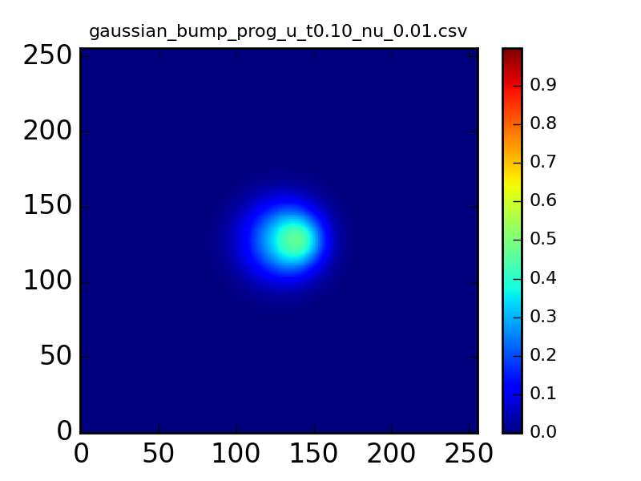
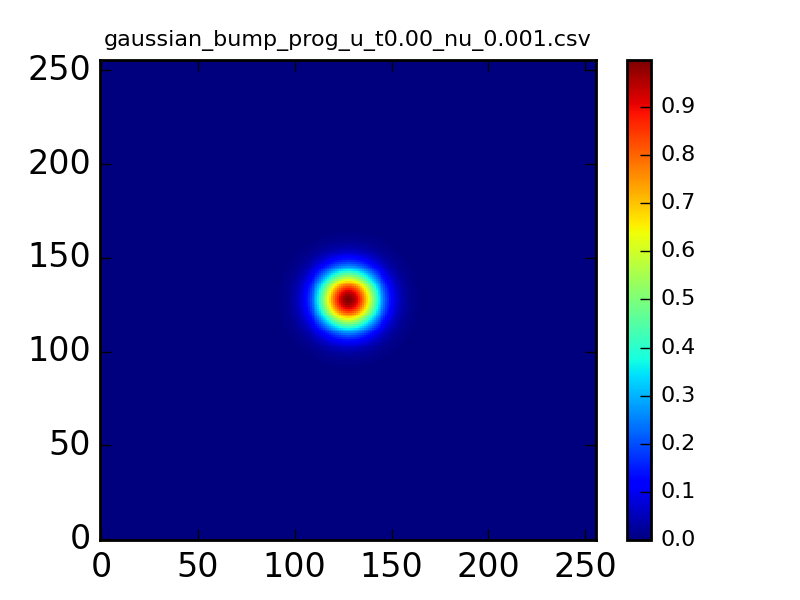
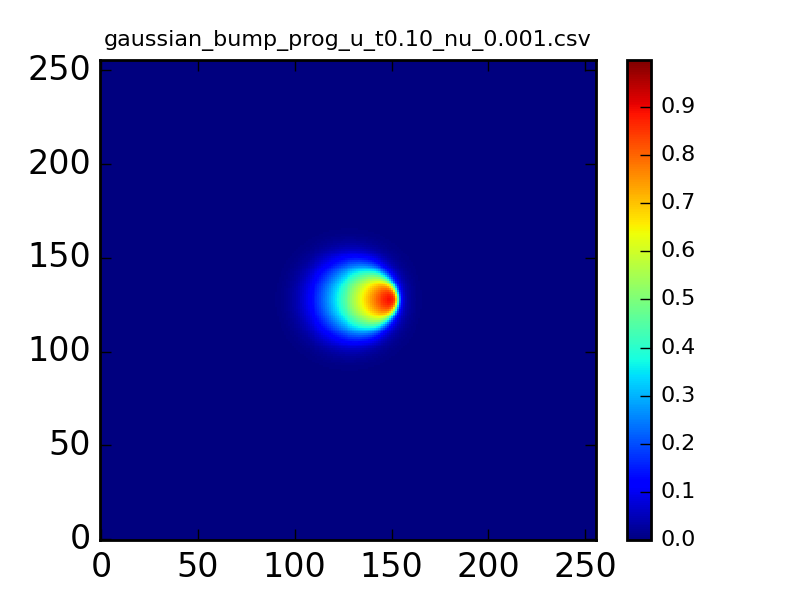
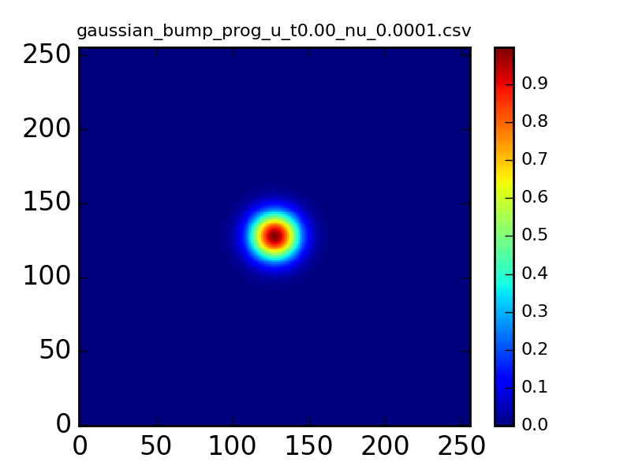
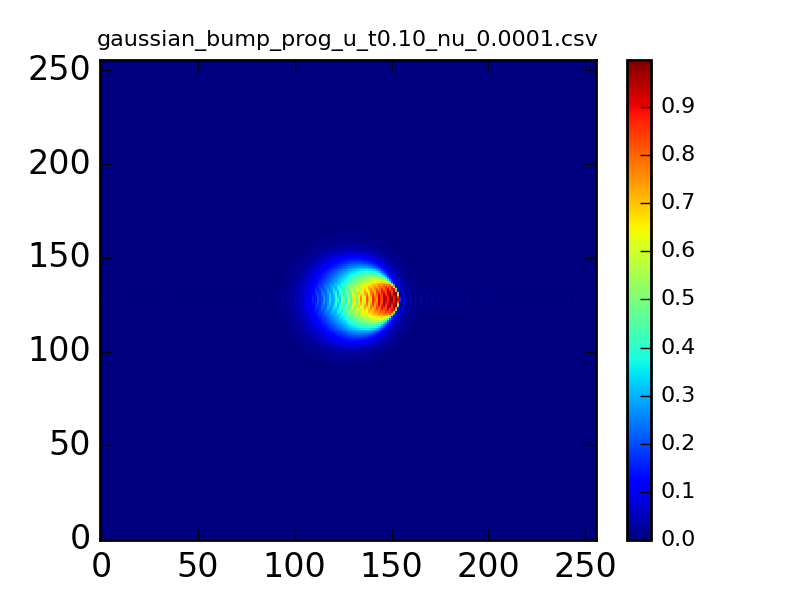

U-velocity field initialized with Gaussian bump. Different tests are run to show the influence of the viscosity on the result. 

Benchmark: 
* Program "burgers" 
* Scenario "-s 0" 

Results can be recreated following the [tutorial](../tutorials/burgers_tut.html).

## Test case viscosity 1 ##
Strong diffusion dissipates the initial bump fast. At times T=0.05 and T=0.1 the velocity is already close to zero.
### T=0 ###

### T=0.05 ###

### T=0.1 ###

## Test case viscosity 0.1 ##
The viscosity of 0.1 still shows mostly a diffusive behavior of the Burgers equation.
### T=0 ###

### T=0.05 ###

### T=0.1 ###

## Test case viscosity 0.01 ##
With this test case the influence of both diffusion and advection can be seen.
### T=0 ###

### T=0.05 ###

### T=0.1 ###

## Test case viscosity 0.001 ##
The choice of 0.001 for the viscosity shows strong advection. Influence of the diffusion can still be seen.
### T=0 ###

### T=0.05 ###

### T=0.1 ###

## Test case viscosity 0.0001 ##
The small viscosity reduces the diffusion to a point, where mostly advection is happening. At T=0.1 it can be seen, that the discretization is not able to resolve the steep velocity gradient on the right hand side leading to the visible errors.
### T=0 ###

### T=0.05 ###

### T=0.1 ###

