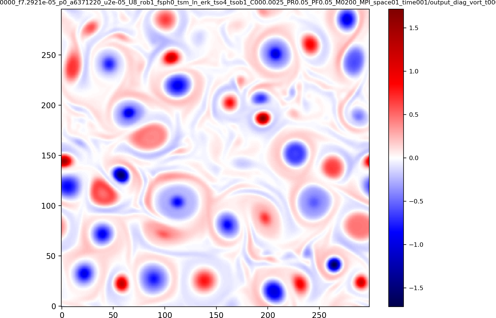
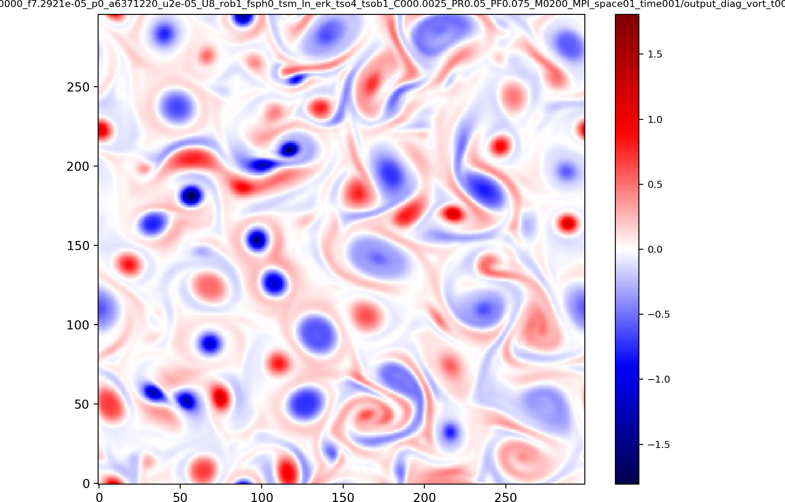
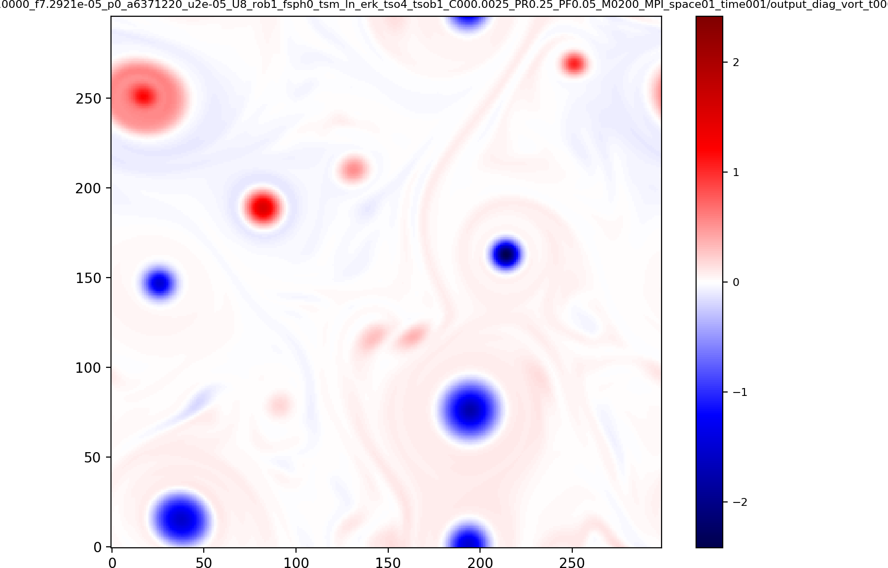
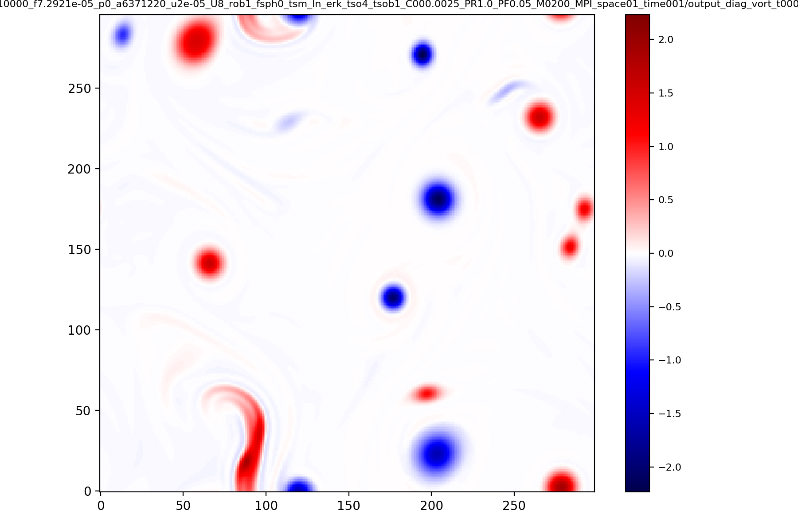
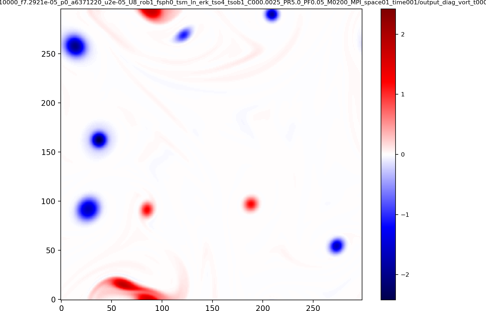
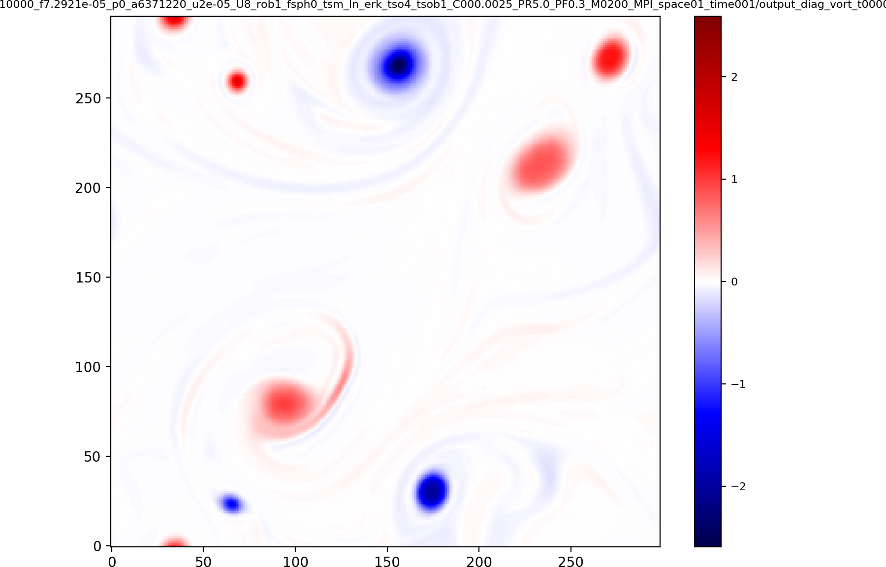
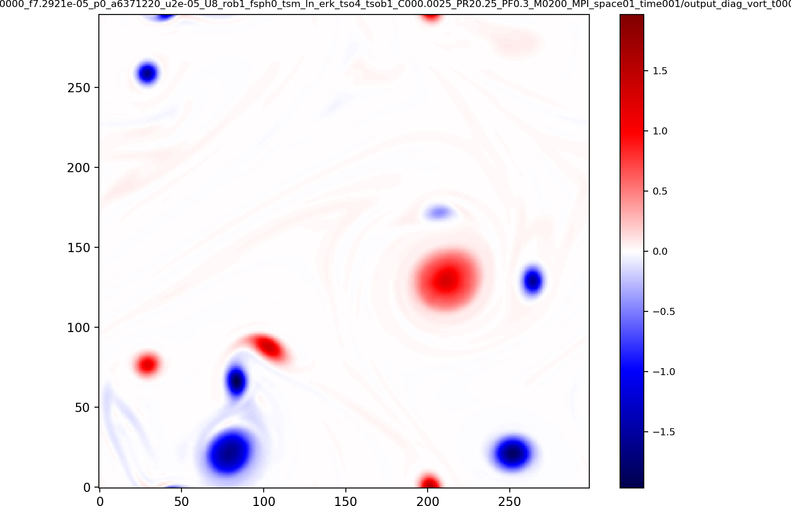
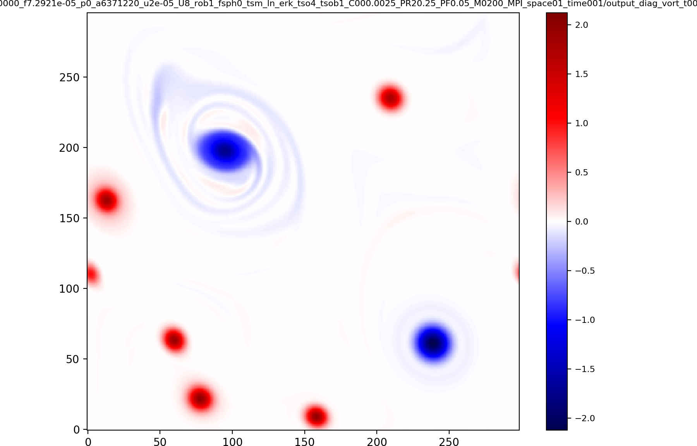
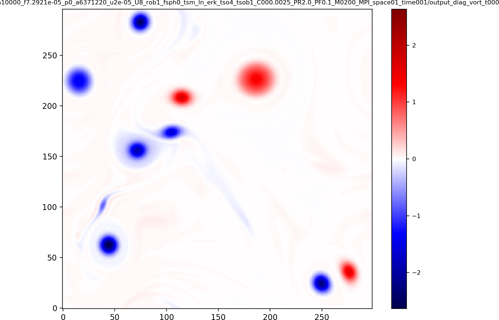
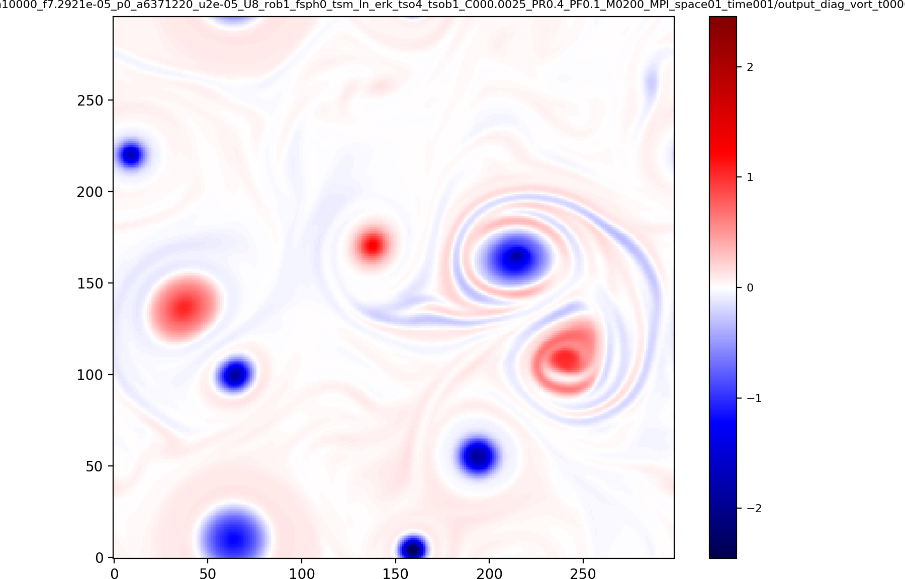

Vorticity at T=1000 for Polvani initial conditions (see "The coherent structures of shallow‐water turbulence: Deformation‐radius effects, cyclone/anticyclone asymmetry and gravity‐wave generation", Polvani et al.) 

Benchmark directory: ./benchmarks_plane/polvani/

<h2>Test case A</h2>

<h2>Test case B</h2>

<h2>Test case C</h2>

<h2>Test case D</h2>

<h2>Test case F</h2>

<h2>Test case H</h2>

<h2>Test case I</h2>

<h2>Test case J</h2>

<h2>Test case K</h2>

<h2>Test case L</h2>

<h2>Test case M</h2>

<h2>Test case N</h2>

